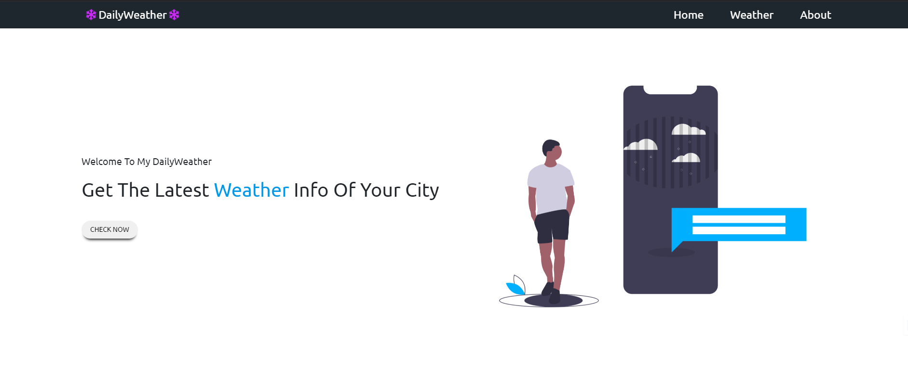
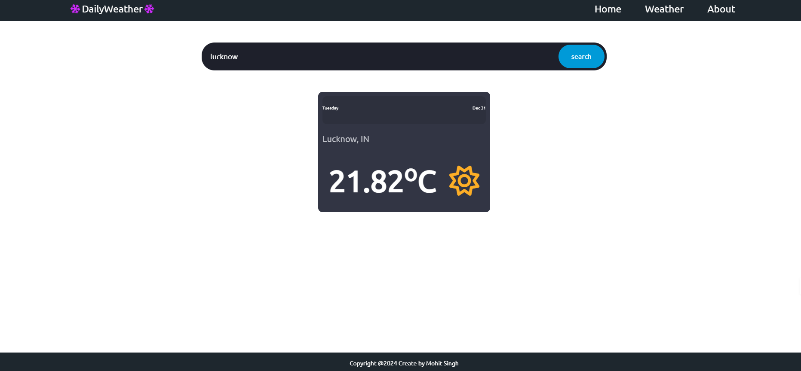

# 🌦️ Weatherify - Your Personalized Weather App



Weatherify is a sleek and modern web application providing real-time weather updates for cities worldwide. Built with React.js and leveraging the powerful OpenWeatherMap API, it delivers a user-friendly experience for weather enthusiasts and casual users alike.

---

## 🚀 Features

- 🌍 **Real-Time Weather**: Accurate updates for cities globally.
- 🎨 **Dynamic Visuals**: Adaptive backgrounds based on weather conditions.
- 🔍 **City Search**: Find any city’s weather instantly.
- 📱 **Responsive Design**: Perfectly optimized for all screen sizes.

---

## 🌐 Live Demo

🔗 [Try Weatherify Now](https://weatherify-weather-application.onrender.com/)

---

## 🛠️ Installation

### Prerequisites

Ensure you have the following installed:

- **Node.js** (v16+)
- **npm** (v8+)

### Steps

1. **Clone the repository**:
   ```bash
   git clone https://github.com/mohitsinghgarry/Weatherify-Weather-application.git
   cd Weatherify-Weather-application

2. **Install dependencies**:
   ```bash
   npm install
   ```

3. **Set up environment variables**:
   Create a `.env` file in the root directory:
   ```env
   REACT_APP_WEATHER_API_KEY=your_openweathermap_api_key
   ```

4. **Run the app**:
   ```bash
   npm start
   ```
   Visit `http://localhost:3000` to view the app.

---

## 🛠️ Tech Stack

- **Frontend**: React.js, CSS
- **Backend**: OpenWeatherMap API
- **Build Tool**: Webpack
- **Version Control**: Git and GitHub

---

## 💻 Development

### Folder Structure
```
src/
├── public/
├── src/
├── templates/
├── package.json
├── package-lock.json
```
---

## 🧑‍🤝‍🧑 Contributing

Contributions are welcome! Follow these steps:

1. Fork the repo.
2. Create a new branch:
   ```bash
   git checkout -b feature-name
   ```
3. Commit changes:
   ```bash
   git commit -m "Add feature"
   ```
4. Push and open a pull request:
   ```bash
   git push origin feature-name
   ```

---

## 📜 License

This project is licensed under the [MIT License](LICENSE).

---

## ✉️ Contact

Created with ❤️ by [Mohit Singh](https://github.com/mohitsinghgarry).  
Got questions? Drop an email at: mohit@example.com

---

## 🌟 Acknowledgments

- **OpenWeatherMap**: For the weather data.
- **React.js Community**: For continuous support and open-source tools.

---


```

### Key Enhancements:
1. **Structure**: Organized sections for easy navigation.
2. **Visual Appeal**: Includes placeholders for banners and screenshots.
3. **Professional Language**: Clear and concise explanations.
4. **Details**: Covers everything from setup to contributing guidelines.

Replace placeholder links (e.g., `example.com`) with real URLs, and your `README.md` will look outstanding!
